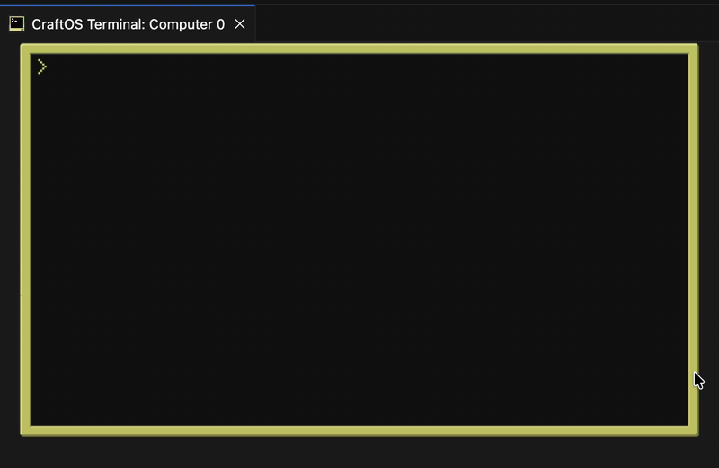

# Orchard — app store for CraftOS

An in-game client for [PineStore](https://pinestore.cc), the community catalog of
ComputerCraft / CC:Tweaked programs. Browse 150+ community apps, search them, and
**install with one keypress** — no copy-pasting `wget` URLs. Everything lands in a
single `/apps` folder and is runnable by name.



Orchard doesn't host a registry of its own. It rides PineStore's existing,
populated catalog and public API, so there's real content from the first launch.

## Install

On any CC:Tweaked / CraftOS-PC computer with HTTP enabled:

```
wget run https://raw.githubusercontent.com/paolojn/orchard/main/orchard/install.lua
```

Then type `orchard`. (It also auto-loads on boot via `/startup.lua`.)

## Run

After the first reboot (so `/startup.lua` registers it on the path):

```
orchard                       open the store (interactive)
orchard search <text>         search the catalog
orchard info    <id|name>     show a project's details
orchard install <id|name>     install into /apps
orchard list                  list installed packages
orchard update  <id|name|all>
orchard remove  <id|name>
orchard config  installdir <path>
```

Before the first reboot you can still run it as `orchard/orchard`.

### Interactive store

| Key                 | Action                                |
| ------------------- | ------------------------------------- |
| type                | live-filter the catalog               |
| `↑ ↓` / `PgUp/PgDn` | move                                  |
| `Enter`             | open a project's page                 |
| `I`                 | install (asks to confirm)             |
| `R`                 | remove (on installed projects)        |
| `B` / `Bksp`        | go back (on a project page)           |
| `Tab`               | your installed apps                   |
| `Bksp`              | delete a search char; quit when empty |

> This build of CraftOS-PC doesn't map the `Esc` key (`keys.escape` is nil), so
> Orchard uses **Backspace** to go back / quit.

## One place to install

Apps install into a single directory (default `/apps`), and `/startup.lua` puts
that directory on the shell path. So after installing, say, Doom you can just type:

```
Doom
```

from anywhere — no path juggling. Change the location with
`orchard config installdir /games` (then reboot to re-path).

## How it works

- Pulls the whole catalog once from `GET /api/projects`, caches it, and filters
  locally — search is instant.
- Each PineStore record carries its own `install_command` (usually a `wget` or
  `pastebin` line) and `target_file`. Orchard runs the author's own command with
  the working directory pointed at `/apps`, so single files, `pastebin get`, and
  multi-file `wget run` installers all land in one place.
- `pastebin run CODE` is rewritten to `pastebin get CODE <file>` so programs are
  **saved** (and launchable later) instead of just executed once.
- Installed packages are tracked in `orchard/installed.db` for `list` / `update`
  / `remove`. Updating re-runs the stored install command.
- Installs are reported via `POST /api/log/download`, so they count toward the
  project's public download stats.

## Layout

```
/startup.lua             puts /orchard and /apps on the shell path
/apps/                   where installed programs live
/orchard/
├── orchard.lua          entry point: CLI dispatch + interactive store
├── lib/
│   ├── pinestore.lua    PineStore API client (list/search/get/logDownload)
│   ├── registry.lua     local installed-packages manifest
│   ├── installer.lua    install / update / remove (into the apps folder)
│   ├── config.lua       persisted settings (install directory)
│   ├── ui.lua           terminal UI toolkit (list, modal, wrap, header/footer)
│   └── log.lua          colored CLI output
└── screens/
    ├── browse.lua       catalog + incremental search
    ├── details.lua      project page + install/remove
    └── installed.lua    manage installed apps
```

## Requirements

- CC:Tweaked / CraftOS-PC with **HTTP enabled** (the default).
- Access to `pinestore.cc` and the hosts projects install from (GitHub, gists,
  pastebin) — allowed by default in CraftOS-PC.

## Credits

Catalog and API by **PineStore** (pinestore.cc). Orchard is an independent client.
